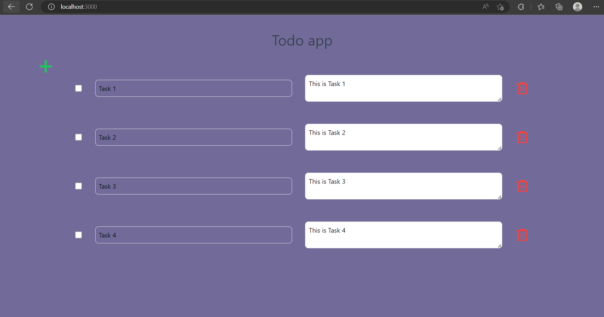

# TodoApp
A Todo app built using React, Spring Boot 3

## Runtime


## Prerequisites

Before you begin, make sure you have the following installed on your system:

- Java Development Kit (JDK) 8 or higher
- Node.js
- Yarn

## Getting Started

Follow the steps below to set up and run the project locally.

### Backend (Spring Boot)

1. Clone this repository to your local machine.

```console
git clone https://github.com/Wafik20/TodoApp.git
```
2. Run the Spring Boot project

```console
cd spring-boot-react-project
./gradlew build
./gradlew bootRun
```
The backend server will start on `http://localhost:8080`.

### Frontend (React using Tailwind CSS)

1. Navigate to the frontend directory.
 ```console
cd frontend
```
2- Install the dependencies using Yarn.
 ```console
yarn install
```
3. Start the React development server.
 ```console
yarn start
```
The frontend server will start on `http://localhost:3000`.
